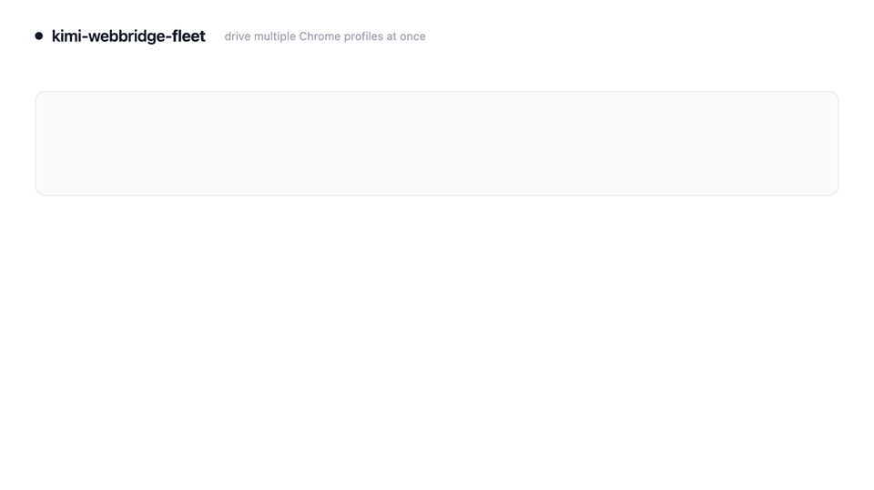

# kimi-webbridge-fleet

> Drive **multiple Chrome profiles** (separate Google logins) **simultaneously** through [Kimi WebBridge](https://www.kimi.com/features/webbridge) — one daemon per profile, one router, deterministic ports.

<p align="center">
  
  <br><em>Illustration of the flow — one AI agent driving two profiles at once. Not a screen recording.</em>
</p>

[Kimi WebBridge](https://www.kimi.com/features/webbridge) lets an AI agent drive your real Chrome with your real logins. By design it has a **single connection slot**: one daemon, one extension, one profile. If you have a work account and a personal account, only one can be driven at a time — the other is rejected until you quit its Chrome or toggle its extension off.

`kimi-webbridge-fleet` removes that limit **without patching anything**. It runs one stock daemon per profile on its own port, and puts a small router on the usual `:10086` so your existing calls keep working — you just add a `"profile"` field.

<p align="center">
  
</p>

## Before / after

<p align="center">
  
</p>

## How it works

The stock daemon enforces two singletons:

1. **Daemon singleton** — `kimi-webbridge start` refuses to launch if anything answers `http://127.0.0.1:10086/status` (the probe is hardcoded to `:10086`, regardless of `--addr`).
2. **Slot singleton** — one daemon accepts exactly one extension connection.

The key observation: the daemon singleton only guards **`:10086`**. Leave `:10086` empty and you can start as many daemons as you like on other ports — each its own independent slot. So fleet:

- starts **one stock daemon per profile** on a deterministic port (`10100 + hash(profileDir)`), each with its own state dir;
- runs a **router on `:10086`** that proxies `/command` to the right daemon based on a top-level `"profile"` field;
- leaves each profile's extension to connect to its own daemon's `/ws` **directly** (the router only proxies HTTP).

No binary patching, nothing that breaks on a Kimi WebBridge upgrade.

> **Implementing this natively?** If you maintain Kimi WebBridge (or want to send a patch), [`docs/UPSTREAM-NATIVE-MULTIPROFILE.md`](docs/UPSTREAM-NATIVE-MULTIPROFILE.md) is an explicit, agent-followable spec for adding multi-profile support **inside** the daemon + extension — grounded in the observed protocol, with acceptance tests. With those changes, fleet becomes unnecessary.

## Platform & scope

**macOS + Google Chrome only, right now.** The implementation leans on
macOS-specific commands and Chrome-specific paths:

| Used for | macOS command / path (this tool) | Linux/Windows equivalent (not yet implemented) |
|---|---|---|
| Open a profile window / wake the extension | `"/Applications/Google Chrome.app/Contents/MacOS/Google Chrome" --profile-directory=… <urls>` (binary direct, headful) | `google-chrome --profile-directory=…` / `start chrome …` |
| Is Chrome running | `pgrep -x "Google Chrome"` | `pgrep chrome` / `tasklist` |
| Quit Chrome (to write `storage.local`) | `osascript … quit` then `pkill` | `pkill chrome` / `taskkill` |
| Force-install policy | `defaults write com.google.Chrome …` | policy JSON in `/etc/opt/chrome/policies/…` / registry |
| Profiles + sessions + extension registry | `~/Library/Application Support/Google/Chrome` | `~/.config/google-chrome` / `%LOCALAPPDATA%\…\Chrome\User Data` |

Porting is mostly swapping those helpers (`src/profiles.mjs`, `src/extension.mjs`).
PRs welcome. **Chromium/Brave/Edge** would also need their own paths and extension id.

## Requirements

- **macOS** + **Google Chrome**, and a working [Kimi WebBridge](https://www.kimi.com/features/webbridge) install (see below).
- Node.js ≥ 18 (no npm dependencies — pure built-ins; runs under `bun` too).

### Installing Kimi WebBridge (prerequisite)

Two steps, straight from [kimi.com/features/webbridge](https://www.kimi.com/features/webbridge) (the "With Local Agent" flow):

**1. Get the Chrome extension** — [Kimi WebBridge on the Chrome Web Store](https://chromewebstore.google.com/detail/kimi-webbridge/fldmhceldgbpfpkbgopacenieobmligc).

**2. Install the local daemon** with the official bootstrap installer:

```bash
curl -fsSL https://cdn.kimi.com/webbridge/install.sh | bash
```

This downloads the binary to **`~/.kimi-webbridge/bin/kimi-webbridge`** (the path fleet orchestrates), starts the daemon, and installs the WebBridge skill into detected AI-agent runtimes.

```bash
# verify it's installed and the stock daemon answers
~/.kimi-webbridge/bin/kimi-webbridge status
# keep it current
~/.kimi-webbridge/bin/kimi-webbridge upgrade
```

## Install

```bash
git clone https://github.com/jeet-dhandha/kimi-webbridge-fleet.git
cd kimi-webbridge-fleet
npm link        # optional: puts `kwb` on your PATH
# or just run:  node bin/kwb.mjs <cmd>
```

## Quickstart

```bash
# 1. See your profiles, their assigned ports, and which have the extension
kwb profiles

# 2. Point each profile's extension at its OWN daemon — zero clicks (no popup).
#    This writes the extension's local_url on disk, which needs Chrome closed, so
#    kwb connect quits Chrome for you (your session is saved for restore).
kwb connect "Work" "Personal"

# 3. Bring up the daemons + router on :10086, reopen each window, WAKE each extension,
#    and poll until each reports "✓ connected". (If Chrome is already fully quit,
#    `kwb up` alone performs the connect write for you — step 2 is optional then.)
kwb up "Work" "Personal"

# 4. Drive any profile by name — same call, one extra field:
curl -s -X POST http://127.0.0.1:10086/command \
  -H 'Content-Type: application/json' \
  -d '{"action":"navigate","args":{"url":"https://search.google.com/search-console"},"session":"audit","profile":"Work"}'

# 5. When done
kwb down            # stops the fleet, restores the stock :10086 daemon
```

A request with no `"profile"` is routed to your default (last-used profile whose daemon is up, or `KWB_DEFAULT_PROFILE`).

## Zero-click connect (no popup)

Pointing a profile's extension at its own daemon port used to be a manual click in the
extension popup. Fleet now does it for you, with **no popup, no CDP, no dependencies** —
in two halves, both pure Node:

1. **Write the URL.** The extension's daemon URL is a plain `local_url` key in its
   `chrome.storage.local` LevelDB (which, unlike Secure Preferences, is **not**
   integrity-protected). `kwb connect` writes it directly while Chrome is closed (LevelDB
   is single-writer), replacing the popup's *Connect* click. The value **persists**, so
   later `kwb up` runs just reconnect.
2. **Wake the worker.** Writing the URL isn't enough on its own: the Kimi WebBridge MV3
   service worker only re-reads `local_url` when it *starts*, but it registers no
   `chrome.runtime.onStartup` listener, so Chrome never auto-starts it on launch — on an
   already-set-up profile the write would otherwise sit unused. `kwb up` wakes the worker
   by opening the extension's own popup page (`chrome-extension://<id>/popup.html`) as a
   tab — the headful equivalent of clicking the toolbar icon. Chrome is launched via its
   binary directly (headful), since macOS `open` doesn't reliably forward a
   `chrome-extension://` URL.

This works for both **Chrome-Web-Store** installs and **unpacked / developer-mode**
builds (whose extension id Chrome assigns unpredictably — fleet identifies the extension
by name and reads back whichever id it was given). To point a profile back at the stock
single `:10086` bridge: `kwb connect "Work" --restore`.

> Why not CDP / `--remote-debugging-port`? Branded Chrome 136+ refuses remote debugging on
> the default user-data-dir where real profiles live, and `--load-extension` is ignored in
> Google Chrome 137+. The on-disk write + popup wake sidesteps both.

## CLI

| Command | What it does |
|---|---|
| `kwb profiles` | List profiles, hashed ports, extension presence + type (`store`/`unpacked`), daemon up? |
| `kwb resolve <query>` | Resolve a name / email / dir to one profile |
| `kwb tabs <profile>` | List a profile's **normal** open tabs (read from Chrome's on-disk session — not the bridge) |
| `kwb status` | Fleet status (every profile's daemon + `extensionConnected`) |
| `kwb state` | Show the last recorded start (timestamp, per-profile connected, all-connected?) and last stop (manual / idle) |
| `kwb connect <profile...>` | Point each profile's extension at its own daemon, zero clicks (writes `local_url` on disk; quits Chrome to do so) |
| `kwb connect <profile...> --restore` | Point them back at the stock `:10086` bridge |
| `kwb up <profile...>` | Stop legacy `:10086`, start the named profiles' daemons + router, reopen windows, **wake each extension**, poll until connected |
| `kwb up --all-ext` | Bring up every profile that already has the extension |
| `kwb up --no-open` | Start daemons + router only; don't open windows |
| `kwb up --no-connect` | Don't touch `storage.local`; just open windows |
| `kwb down [--no-restore]` | Stop router + fleet daemons; restore the legacy `:10086` daemon |
| `kwb install --forcelist` | Enable Chrome force-install across **all** profiles (needs a Chrome restart) |
| `kwb install --missing` | List profiles lacking the extension |

`<profile>` is anything that resolves uniquely: the profile **name** (`"Work"`), an **email**, or the Chrome **directory** (`"Profile 2"`).

Running `kwb` with no command (or an unknown one) prints the usage line.

### Debug / internals

Each module is runnable on its own for inspection (no daemon needed):

```bash
node src/profiles.mjs                      # dump all profiles as JSON
node src/profiles.mjs "Work"               # resolve one profile
node src/storage.mjs read  "Profile 8"     # read the extension's on-disk local_url
node src/storage.mjs store "Profile 8"     # locate its storage.local LevelDB dir
node src/extension.mjs status              # forcelist + unpacked-ext path
node src/extension.mjs missing             # profiles lacking the extension
node src/extension.mjs enable-forcelist    # / disable-forcelist
node src/snss.mjs "Work"                   # a profile's open tabs (from Chrome's SNSS session)
node src/fleet.mjs status                  # per-profile daemon status table
node src/fleet.mjs start "Work"            # / stop "Work" — one daemon, directly
```

## Kimi WebBridge daemon (the layer underneath)

Fleet supervises the **stock** `kimi-webbridge` daemon — it contains no Kimi WebBridge code
of its own. Manage the daemon (and get its help) directly with its binary:

```bash
~/.kimi-webbridge/bin/kimi-webbridge --help        # list all daemon commands
~/.kimi-webbridge/bin/kimi-webbridge <cmd> --help  # help for one command
```

| Command | What it does |
|---|---|
| `kimi-webbridge status` | Daemon status (with fleet up, `:10086` is the router, so this shows the whole fleet) |
| `kimi-webbridge start` | Start the daemon in the background |
| `kimi-webbridge stop` | Stop the daemon |
| `kimi-webbridge restart` | Restart the daemon |
| `kimi-webbridge logs` | Show daemon logs |
| `kimi-webbridge upgrade` | Download + install the latest release |
| `kimi-webbridge install-skill` | Install the WebBridge skill into detected AI-agent runtimes |
| `kimi-webbridge uninstall` | Stop the daemon and remove `~/.kimi-webbridge/` |
| `kimi-webbridge completion` | Generate a shell autocompletion script |

> `kwb up` / `kwb down` already call `kimi-webbridge start` / `stop` for you to free and
> restore `:10086`; reach for the binary directly only for `logs`, `upgrade`, or manual
> recovery.

## Reading a profile's open tabs

Kimi WebBridge's `list_tabs` only returns tabs from its own session. To answer "what does the user actually have open in profile X", fleet reads Chrome's own session journal (SNSS) straight from disk — no bridge, no running daemon required:

```bash
kwb tabs "Work"
# Work (Profile 2) :13222 — 6 open tab(s)
#   [..] Search Console — https://search.google.com/search-console/...
#   [..] Gmail — https://mail.google.com/...
```

## Auto-installing the extension into other profiles

```bash
kwb install --missing          # which profiles lack the extension
kwb install --forcelist        # add it to Chrome's force-install policy (all profiles; restart Chrome)
```

Fleet recognizes the extension whether it's installed from the **Chrome Web Store** or
loaded **unpacked** (developer mode) — `kwb profiles` shows which (`store` / `unpacked`).

> Chrome can't inject an extension into an already-running profile from the outside, and
> `--load-extension` is **ignored** in branded Google Chrome 137+. So installation is via
> the force-install policy above (or the Web Store, or "Load unpacked" in `chrome://extensions`),
> and takes effect on a Chrome restart. That's a Chrome constraint, not a fleet one.

## Configuration

Environment overrides (sensible macOS defaults otherwise):

| Var | Purpose |
|---|---|
| `KWB_DEFAULT_PROFILE` | Profile to use when a call omits `"profile"` |
| `KWB_CHROME_DIR` | Chrome user-data dir (e.g. Chrome Beta) |
| `KWB_CHROME_BIN` | Chrome binary path |
| `KWB_EXT_PATH` | Path to the unpacked Kimi WebBridge extension |
| `KWB_KIMI_BIN` | Path to the `kimi-webbridge` binary |
| `KWB_ROUTER_PORT` | Router port (default `10086`) |
| `KWB_IDLE_TIMEOUT_MIN` | Minutes of no `/command` before the fleet auto-closes (default `120`; `0` disables). Fractional allowed. |
| `KWB_IDLE_NO_RESTORE` | On idle auto-close, leave `:10086` empty instead of restoring the stock daemon |

## Notes & limitations

- **No popup step.** Pointing each profile's extension at its port is fully automated (`kwb connect` + the wake in `kwb up`) — see [Zero-click connect](#zero-click-connect-no-popup). Writing `local_url` requires Chrome closed, so `kwb connect` quits Chrome (session saved) for the few seconds it takes.
- **Idle auto-close.** If no `/command` is routed for `KWB_IDLE_TIMEOUT_MIN` minutes (default `120`), the router closes the fleet itself — it stops the daemon **processes only** and **leaves your browser tabs open** (the extensions just disconnect). The start/stop is recorded in `~/.kimi-webbridge/multi/run/fleet-state.json` (`kwb state`). Set `KWB_IDLE_TIMEOUT_MIN=0` to disable.
- **macOS first.** Paths assume macOS Chrome; Linux support is a small change to the path helpers (PRs welcome).
- **Not affiliated with Moonshot AI / Kimi.** This is an independent layer that orchestrates the stock daemon and reads Chrome's own files. It contains no Kimi WebBridge code.

## License

MIT © jeet-dhandha
