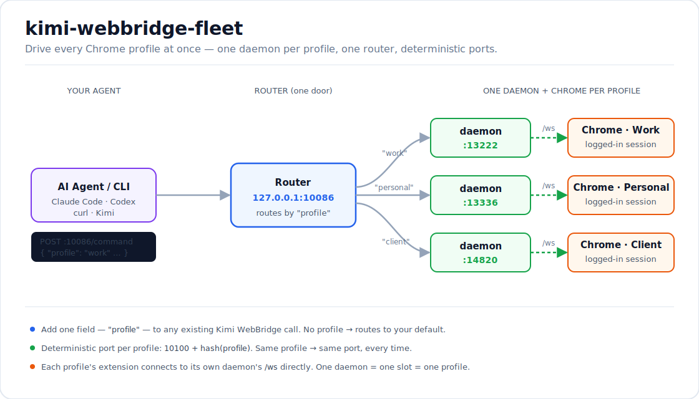
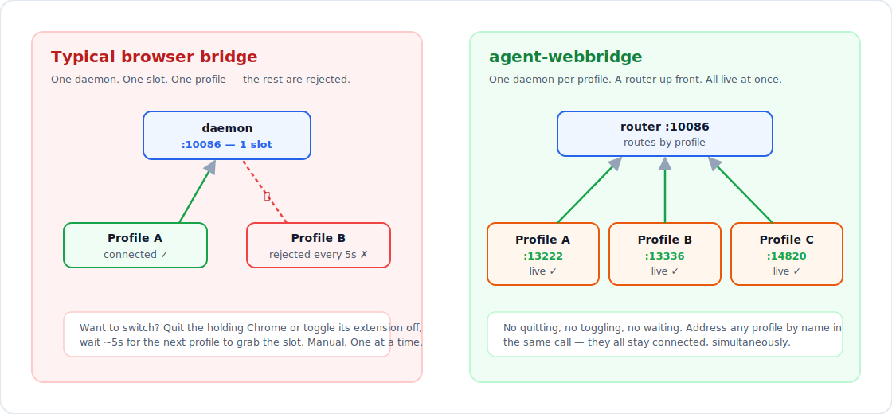

# kimi-webbridge-fleet

> Drive **multiple Chrome profiles** (separate Google logins) **simultaneously** through [Kimi WebBridge](https://www.kimi.com/features/webbridge) — one daemon per profile, one router, deterministic ports.

[Kimi WebBridge](https://www.kimi.com/features/webbridge) lets an AI agent drive your real Chrome with your real logins. By design it has a **single connection slot**: one daemon, one extension, one profile. If you have a work account and a personal account, only one can be driven at a time — the other is rejected until you quit its Chrome or toggle its extension off.

`kimi-webbridge-fleet` removes that limit **without patching anything**. It runs one stock daemon per profile on its own port, and puts a small router on the usual `:10086` so your existing calls keep working — you just add a `"profile"` field.

<p align="center">
  
</p>

## Before / after

<p align="center">
  
</p>

## How it works

The stock daemon enforces two singletons:

1. **Daemon singleton** — `kimi-webbridge start` refuses to launch if anything answers `http://127.0.0.1:10086/status` (the probe is hardcoded to `:10086`, regardless of `--addr`).
2. **Slot singleton** — one daemon accepts exactly one extension connection.

The key observation: the daemon singleton only guards **`:10086`**. Leave `:10086` empty and you can start as many daemons as you like on other ports — each its own independent slot. So fleet:

- starts **one stock daemon per profile** on a deterministic port (`10100 + hash(profileDir)`), each with its own state dir;
- runs a **router on `:10086`** that proxies `/command` to the right daemon based on a top-level `"profile"` field;
- leaves each profile's extension to connect to its own daemon's `/ws` **directly** (the router only proxies HTTP).

No binary patching, nothing that breaks on a Kimi WebBridge upgrade.

> **Implementing this natively?** If you maintain Kimi WebBridge (or want to send a patch), [`docs/UPSTREAM-NATIVE-MULTIPROFILE.md`](docs/UPSTREAM-NATIVE-MULTIPROFILE.md) is an explicit, agent-followable spec for adding multi-profile support **inside** the daemon + extension — grounded in the observed protocol, with acceptance tests. With those changes, fleet becomes unnecessary.

## Requirements

- macOS, Google Chrome, and a working [Kimi WebBridge](https://www.kimi.com/features/webbridge) install (`~/.kimi-webbridge/bin/kimi-webbridge`).
- Node.js ≥ 18 (no npm dependencies — pure built-ins; runs under `bun` too).

## Install

```bash
git clone https://github.com/jeet-dhandha/kimi-webbridge-fleet.git
cd kimi-webbridge-fleet
npm link        # optional: puts `kwb` on your PATH
# or just run:  node bin/kwb.mjs <cmd>
```

## Quickstart

```bash
# 1. See your profiles, their assigned ports, and which have the extension
kwb profiles

# 2. Bring up daemons for the profiles you want + the router on :10086
kwb up "Work" "Personal"

# 3. ONE-TIME per profile: open that profile's Kimi WebBridge extension popup,
#    set the daemon URL to its port (kwb profiles shows it), e.g.
#       ws://127.0.0.1:13222/ws
#    then Connect.

# 4. Drive any profile by name — same call, one extra field:
curl -s -X POST http://127.0.0.1:10086/command \
  -H 'Content-Type: application/json' \
  -d '{"action":"navigate","args":{"url":"https://search.google.com/search-console"},"session":"audit","profile":"Work"}'

# 5. When done
kwb down            # stops the fleet, restores the stock :10086 daemon
```

A request with no `"profile"` is routed to your default (last-used profile whose daemon is up, or `KWB_DEFAULT_PROFILE`).

## CLI

| Command | What it does |
|---|---|
| `kwb profiles` | List profiles, hashed ports, extension presence, daemon up? |
| `kwb resolve <query>` | Resolve a name / email / dir to one profile |
| `kwb tabs <profile>` | List a profile's **normal** open tabs (read from Chrome's on-disk session — not the bridge) |
| `kwb status` | Fleet status (every profile's daemon) |
| `kwb up <profile...>` | Stop legacy `:10086`, start the named profiles' daemons, start the router |
| `kwb up --all-ext` | Bring up every profile that already has the extension |
| `kwb down [--no-restore]` | Stop router + fleet daemons; restore the legacy `:10086` daemon |
| `kwb install <profile>` | Cold-start that profile with `--load-extension` |
| `kwb install --forcelist` | Enable Chrome force-install across **all** profiles (needs a Chrome restart) |
| `kwb install --missing` | List profiles lacking the extension |

`<profile>` is anything that resolves uniquely: the profile **name** (`"Work"`), an **email**, or the Chrome **directory** (`"Profile 2"`).

## Reading a profile's open tabs

Kimi WebBridge's `list_tabs` only returns tabs from its own session. To answer "what does the user actually have open in profile X", fleet reads Chrome's own session journal (SNSS) straight from disk — no bridge, no running daemon required:

```bash
kwb tabs "Work"
# Work (Profile 2) :13222 — 6 open tab(s)
#   [..] Search Console — https://search.google.com/search-console/...
#   [..] Gmail — https://mail.google.com/...
```

## Auto-installing the extension into other profiles

```bash
kwb install --missing          # which profiles lack the extension
kwb install --forcelist        # add it to Chrome's force-install policy (all profiles; restart Chrome)
kwb install "Work"             # or cold-start a single profile with the unpacked extension loaded
```

> Chrome can't inject an extension into an already-running profile from the outside — both paths take effect on a Chrome (re)start. That's a Chrome constraint, not a fleet one.

## Configuration

Environment overrides (sensible macOS defaults otherwise):

| Var | Purpose |
|---|---|
| `KWB_DEFAULT_PROFILE` | Profile to use when a call omits `"profile"` |
| `KWB_CHROME_DIR` | Chrome user-data dir (e.g. Chrome Beta) |
| `KWB_CHROME_BIN` | Chrome binary path |
| `KWB_EXT_PATH` | Path to the unpacked Kimi WebBridge extension |
| `KWB_KIMI_BIN` | Path to the `kimi-webbridge` binary |
| `KWB_ROUTER_PORT` | Router port (default `10086`) |

## Notes & limitations

- **One-time popup step per profile.** Pointing a profile's extension at its port is a manual click in the extension popup; there's no external API to set it.
- **macOS first.** Paths assume macOS Chrome; Linux support is a small change to the path helpers (PRs welcome).
- **Not affiliated with Moonshot AI / Kimi.** This is an independent layer that orchestrates the stock daemon and reads Chrome's own files. It contains no Kimi WebBridge code.

## License

MIT © jeet-dhandha
