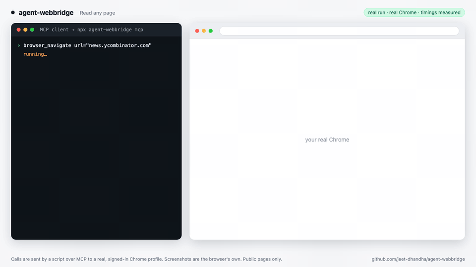
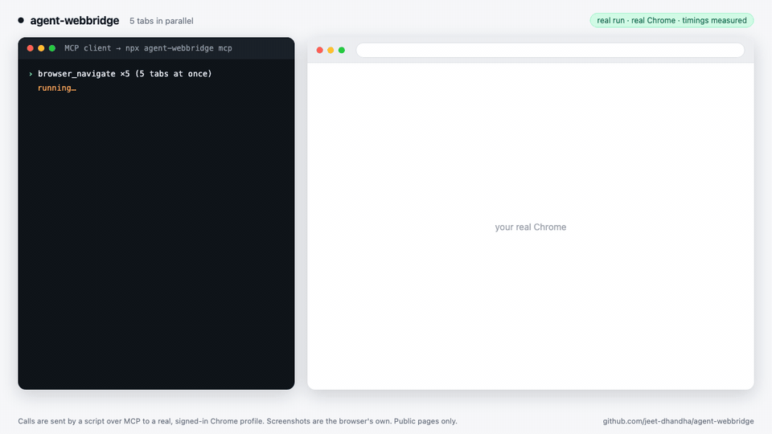
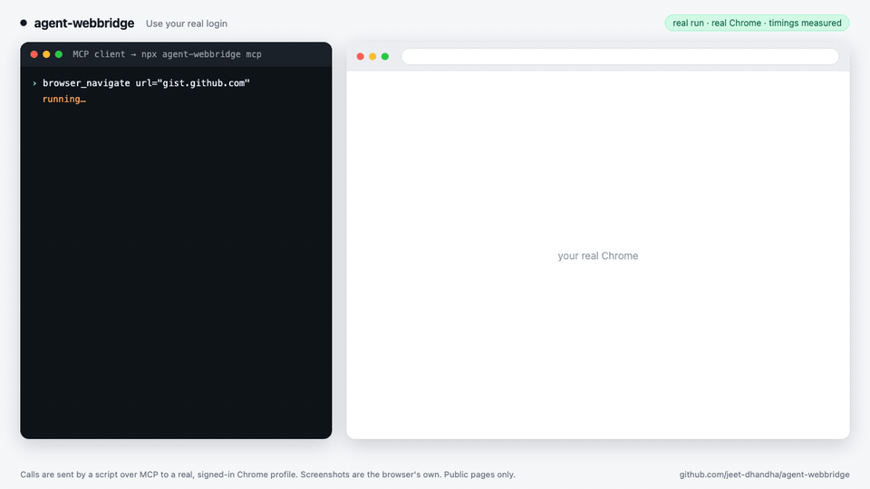
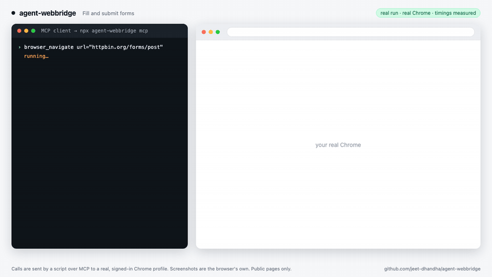

# agent-webbridge

[](https://www.npmjs.com/package/agent-webbridge)
[](https://chromewebstore.google.com/detail/agent-webbridge/kgnhhbkooeplfdkfnicgekdmegckcnpl)
[](LICENSE)
[](https://nodejs.org)

> Let Claude Code, Cursor and any MCP client drive **your real, logged-in Chrome** — **many profiles, many tabs, in parallel**. No headless re-login, no bot detection, no cloud. Nothing leaves `127.0.0.1`.

## Add it to your agent (30 seconds)

```bash
npm i -g agent-webbridge && awb setup "Work"     # once: installs the daemon + the Chrome extension
```

Then add the MCP server to Claude Desktop, Claude Code, Cursor or Windsurf:

```json
{
  "mcpServers": {
    "chrome": { "command": "npx", "args": ["-y", "agent-webbridge", "mcp"] }
  }
}
```

Claude Code: `claude mcp add chrome -- npx -y agent-webbridge mcp`

Your agent now has `browser_navigate`, `browser_snapshot`, `browser_click`, `browser_fill`, `browser_evaluate`, `browser_screenshot` and more — all running in *your* Chrome, with *your* sessions. Pass `profile` to choose an account and `tabId` to run tabs in parallel. If a call fails, `browser_status` tells the agent which profile isn't connected.

### Why not Playwright or a cloud browser?

| | Cloud browsers (Browserbase, Steel…) | Headless Playwright / Puppeteer | **agent-webbridge** |
|---|---|---|---|
| Cost | usage-based | free | **free, MIT** |
| Your logins, passkeys, 2FA | re-auth or upload cookies | re-login; 2FA breaks | **already signed in** |
| Bot detection (Cloudflare, Datadome) | flagged cloud IPs | often blocked | **it's your real browser** |
| Where your data goes | a third-party server | local | **local only, `127.0.0.1`** |
| Several accounts at once | separate sessions to manage | manual orchestration | **one profile per account, parallel tabs** |

It automates a browser you are already signed in to — use it only on accounts and sites you are entitled to automate, and respect each site's terms.

`agent-webbridge` is a tiny Node daemon (one runtime dependency: [`ws`](https://www.npmjs.com/package/ws)) plus a clean-room MV3 Chrome extension. An agent POSTs a command to a local router → the router fans it out to the right profile's daemon → the extension attaches the Chrome DevTools Protocol **per tab**.

## See it work

Real runs, not mock-ups: a script sends MCP calls to `npx agent-webbridge mcp`, which drives a real, signed-in Chrome profile. The screenshots are the browser's own and the timings are measured. Public pages only; nothing is submitted to any account.

| | |
|---|---|
| **Read any page**: snapshot + evaluate on Hacker News<br> | **Five tabs at once**: 3.5 s in parallel vs 9.3 s one at a time<br> |
| **Use your real login**: a signed-in editor, filled in, stopped before publishing<br> | **Fill and submit forms** (fields, radios, checkboxes)<br> |

Timings come from one MacBook on home broadband; yours will differ.

## Overview

- **Drive your real browser** — your actual Chrome, your actual login sessions. No headless re-login, no scraping around auth.
- **Run tabs in parallel** — the extension attaches `chrome.debugger` per tab, so N tabs in one profile run concurrently. 10 tabs finish as fast as 1 (~2 s, flat).
- **Span multiple profiles** — one daemon per profile. Total concurrency = **profiles × tabs**, all from one endpoint.
- **Stay private** — own daemon, own MV3 extension, no closed-source dependency, no account. Everything is local.

## Install

```bash
npm i -g agent-webbridge        # 1. the daemon + the `awb` CLI
awb setup "Work"                # 2. opens the Chrome Web Store; click "Add to Chrome"
```

`awb setup` opens the [**Agent WebBridge** listing](https://chromewebstore.google.com/detail/agent-webbridge/kgnhhbkooeplfdkfnicgekdmegckcnpl) in your chosen profile and **polls** while you click **Add to Chrome**. As soon as it detects the install, it wires the profile to its daemon and brings the fleet up.

**Requirements:** macOS or Windows · Google Chrome · Node.js ≥ 18.

## Quickstart

```bash
awb up "Work" "Personal"        # bring profiles up (setup did this on first run)

# Drive any profile by name — using the handy cmd helper function:
cmd(){ curl -s -m 60 -X POST http://127.0.0.1:10086/command -H 'Content-Type: application/json' -d "$1"; echo; }

cmd '{"action":"navigate","args":{"url":"https://news.ycombinator.com"},"session":"scan","profile":"Work"}'

awb down                        # stop the fleet when done
```

Every call is a `POST /command` on `127.0.0.1:10086`. Wrap payloads in single quotes (`'...'`) to prevent shell quote-escaping issues. `"session"` groups a task's tabs into one Chrome tab group; `"profile"` picks which Chrome profile to drive. Pass `{"action":"screenshot","args":{"path":"/path/to/img.png"}}` to save screenshots directly to disk.

## Tools

| Tool | Does |
|---|---|
| `navigate` | Open a URL in a new or existing tab |
| `find_tab` | Locate a tab by URL / title |
| `evaluate` | Run JavaScript in the page, return the result |
| `snapshot` | Accessibility tree with stable `@e` element refs |
| `click` | Click an element by `@e` ref |
| `trusted_click` | Real mouse click (CDP, `isTrusted`) for pages that ignore `click` |
| `fill` | Set native inputs **and** `contenteditable` fields |
| `upload` | Upload a file to a file input |
| `screenshot` | Capture a page screenshot |
| `save_as_pdf` | Save the page as a PDF |
| `network` | Capture network requests |
| `list_tabs` | List the session's tabs |
| `close_tab` | Close a tab |
| `close_session` | Close a session and its tab group |

## How it works

```
  AI agent  ──HTTP POST /command──▶  router (127.0.0.1:10086)   routes by "profile"
                                          │
                       ┌──────────────────┼──────────────────┐
                       ▼                  ▼                  ▼
                  daemon "Work"      daemon "Personal"     daemon …      one per profile
                       │  WebSocket
                       ▼
                  MV3 extension      ──chrome.debugger (a Map: one attach PER TAB)──▶
                       │
                       ▼
                  Chrome DevTools Protocol      tab 1 ║ tab 2 ║ tab 3   (concurrent)
```

The router proxies each command to the per-profile daemon on its deterministic hashed port; the daemon relays over WebSocket to that profile's extension; the extension keeps a `Map` of `chrome.debugger` attachments — one per tab — and issues CDP calls. That per-tab map is the whole trick: bridges that funnel everything through a single "current tab" can only drive one tab per profile; this drives N.

## CLI

| Command | Does |
|---|---|
| `awb setup <profile…>` | One-time install: walk through "Load unpacked", connect, bring the fleet up |
| `awb up <profile…>` | Start the named profiles' daemons + router, open windows, connect |
| `awb down` | Stop the router + fleet |
| `awb connect <profile…>` | Point each profile's extension at its daemon |
| `awb check [profile…] [--json]` | Read-only readiness probe (folder? dev-mode? loaded? connected?) — what an agent polls during install |
| `awb status` | Per-profile daemon + extension-connection status |
| `awb doctor` | Diagnose the environment (Chrome, profiles, daemon, extension) |
| `awb mcp` | Run the stdio MCP server (what the config above launches) |
| `awb profiles` | List Chrome profiles, their hashed ports, and extension presence |

`<profile>` is anything that resolves uniquely — the profile **name** (`"Work"`), an **email**, or the Chrome **directory** (`"Profile 2"`).

## Use it from an AI agent

Ship it as a [Claude Code skill / plugin](.claude-plugin/) — the bundled `agent-webbridge` skill teaches an agent the full flow (install via `awb check --json`, then drive over `POST /command`). To hack on the extension itself, `awb install-dev` Load-unpacks the in-repo build (`chrome://extensions` → Developer mode → Load unpacked → [`agent-webbridge-extension/`](agent-webbridge-extension/)); it ships its own key, so the dev id is stable across reloads.

## Platform

| | macOS | Windows |
|---|---|---|
| Profile discovery | `~/Library/Application Support/Google/Chrome` | `%LOCALAPPDATA%\Google\Chrome\User Data` |
| Chrome binary | `/Applications/Google Chrome.app` | `Program Files\Google\Chrome\Application\chrome.exe` (auto-detected) |
| Daemon, router, MCP, all tools | ✅ | ✅ |
| Install flow (`awb setup`) | opens the profile window via AppleScript | opens it by launching Chrome with the profile |
| Tab/window housekeeping (focus, tidy blank windows) | ✅ | skipped — cosmetic only |

Set `AWB_CHROME_BIN` / `AWB_CHROME_DIR` if Chrome or its data directory is somewhere non-standard (Chrome Beta, portable installs). Linux paths are wired up but untested.

On Windows, run commands from PowerShell or `cmd` (the `curl` examples below use bash quoting; in PowerShell use `curl.exe` and a here-string, or just use the MCP server). The daemon and the Windows code paths are covered by CI on `windows-latest`; the Chrome-launching steps (`awb setup` / `awb up`) are the least-tested part — please [open an issue](https://github.com/jeet-dhandha/agent-webbridge/issues) if one misbehaves.

## Security

- Everything listens on `127.0.0.1` only. As of 1.3.1 the router and daemons also refuse requests that carry a web `Origin` or a non-loopback `Host`, so a website you visit cannot drive the bridge (see the [changelog](CHANGELOG.md)). Upgrade from earlier versions and restart the fleet with `awb down && awb up`.
- It acts as *you*, in your signed-in browser. Any local program that can reach `127.0.0.1:10086` can do the same, so only run it on a machine and account you trust, and keep irreversible actions (posting, paying, deleting) behind a human confirmation in your agent.
- Report vulnerabilities privately through GitHub's "Report a vulnerability" on the Security tab.

## License

MIT © jeet-dhandha
